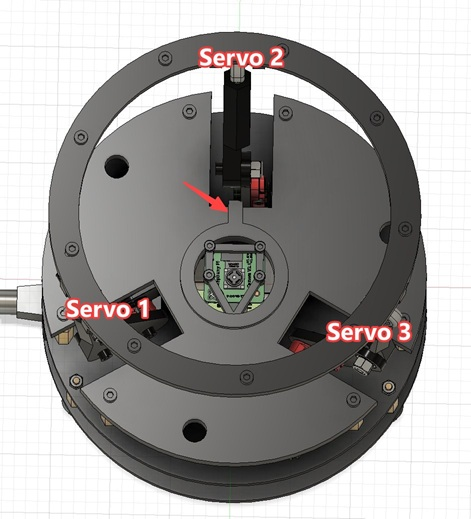
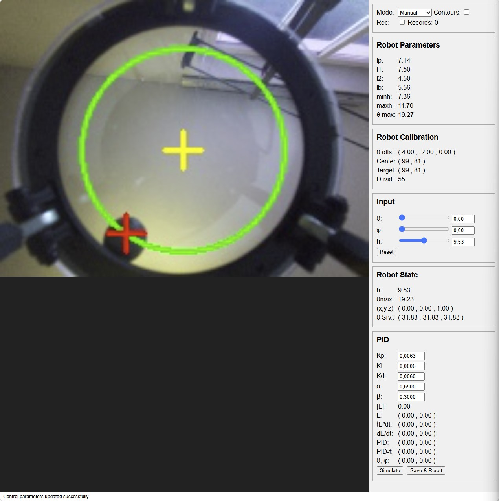
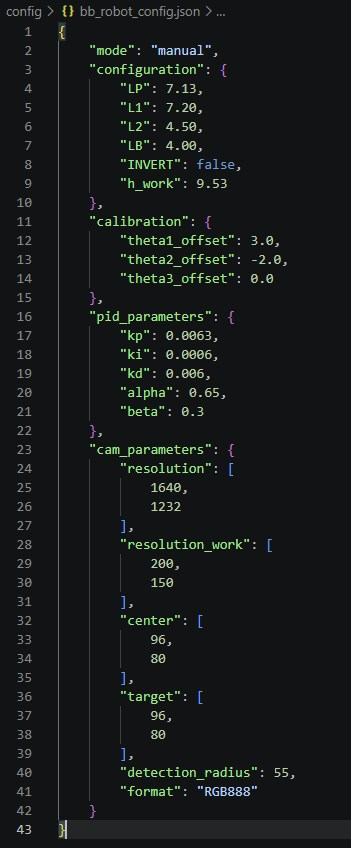
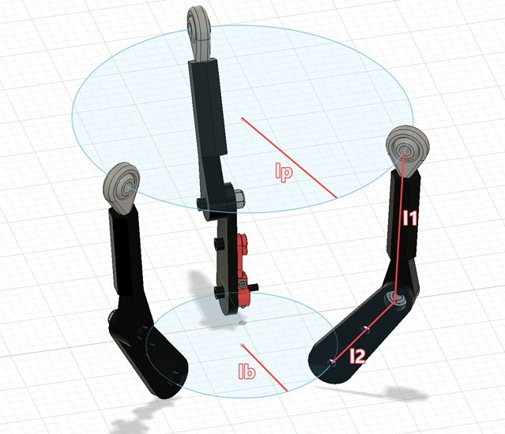

# Ball-Balancing Robot Web UI

The code in this repository refers to the robot published by [I-M-Robotics-Lab](https://github.com/I-M-Robotics-Lab) as [3-D model at makerworld](https://makerworld.com/en/models/1197770-ball-balancing-robot?from=recommend#profileId-1210633) for which code can be found at [Ball-Balancing-Robot at GitHub](https://github.com/I-M-Robotics-Lab/Ball-Balancing-Robot)

Since the Web UI in the original code included just the layout but no functionality, I developed a fully functional Web UI with client-server architecture.

Both, server (bb_robot_server.py) and client (bb_robot_client.py) can be run as services.

The solution is essentially based on the original code [Ball-Balancing-Robot](https://github.com/I-M-Robotics-Lab/Ball-Balancing-Robot), where code from ```controller.py```,  ```robotKinematics.py```, ```camera.py``` and ```PID.py``` were all integrated into the new ```bb_robot_server.py``` with a few architecture-related modifications.

See [Demo Video](https://github.com/signag/Ball-Balancing-Robot_CS/discussions/1).

## 3D Print Model

Some parts of the original model have been modified.     
See [Modified Parts](./docs/model.md).    
There, you will also find an updated parts- and shopping list

## Robot Setup

### Mounting the Robot Arms

Before fixing the robot arms on the servos, it is necessary to bring these into a definite position.

After wiring the servos and setting up the Raspberry Pi, [install the software](./docs/installation.md).

Then connect to the server from a browser (See [Usage](#usage)).

With θ and *φ* set to *0*, move the height (*h*) to the left which corresponds to the minimum height of the robot.

Then mount the robot arms so that the lower arms point slightly upwards with the screws connecting lower and upper arm being slightly below the plate holding the servos (base).

### Camera

As camera, a [Raspberry Pi Camera Module 3 Wide](https://www.raspberrypi.com/documentation/accessories/camera.html#camera-module-3) is recommended because this covers the entire top ring.

### Servo/Camera Alignment

It is essential that servos and camera are correctly aligned



You can verify correctnes of servo numbers by using the calibration function.

## Installation

See [Installation of Ball-Balancing-Robot_CS](docs/installation.md)

Connect to the client from any browser within the same network with     
```http://<server_name>:5000```

## Usage



### Configuration File

The server initializes the robot from a configuration file ```bb_robot_config.json```.    
This file will be located in a ```config``` subdirectory of the active work directory, if this exists.     
If not, a ```~/bb_robot_home``` directory with a ```config``` subdirectory will be created at server start.

If a configuration file exists, contained data will be used for robot initialization.    
If a configuration file does not exist at server start, it will be created with default values.

Example:    


#### Structural Parameters

If the structural parameters (```"configuration"```) for your robot differ from the defaults, you need to update these directly in the configuration file.    
Especially, the length l1 of the upper arm should be verified.



#### Calibration Parameters

Calibration parameters (```"calibration"```) and some of the camera parameters (center, target, detection_radius) will be updated in the file when calibration is saved.

#### PID Parameters

Modified PID parameters will be updated in the file when "Save & Reset" is pressed.     
This function will also reset the PID controller.

#### Setting the Start Mode

By default, the server will start in "Manual" mode.

You can manually set ```"mode": "auto"``` in the configuration file to start in automatic mode.

When changing *Mode* in the dialog, the setting in the configuration file will not be changed.

### Calibration

Choose *Mode* "Calibration".

#### Levelling the Top Panel

Udjust offsets (θ offs.) of the individual servos until the top panel is exactly horizontal.

#### Calibrating Center and Detection Radius

The *Detection Radius* (D-rad) is the maximum radius within which the ball can be detected.     
If the ball approches the top ring, contours of ball and top ring can no longer be destinguished.    
You can activate *Contours* to see the effect.    
In this case the ball position cannot be determined and the system assumes the last detected position.

In order to calibrate the *Detection Radius*, increase *D-rad* until the green circle tuches the top ring. You may need to udjust *Center* to center the circle.

Afterwards, reduce *D-rad* until the distance between the top ring and the green circle is at least the ball radius.

#### Setting the Target

The *Target* is initially identical with *Center*.    
You can modify it to choose a different target.


### PID Simulation

You can simulate the effect of different PID parameters on the resulting orientation of the top panel (θ, φ)


### Recording PID Results

As input for training a Neural Network, PID results can be recorded by activating *Rec* when in *Mode* "Auto".

The number of records recorded so far is updated when the browser window is refreshed.

The resulting file is stored in the ```config``` folder.

### Logging

Logging is initially set to ```ERROR``` logging.     
A file handler is specified with the log file being located in the ```config``` folder.
